# Occasio

**A full-stack platform for creating, promoting and running community events and ceremonies.**

Occasio covers the whole event lifecycle: public discovery and ticketing, an organiser workspace with venue and seat design, QR/barcode check-in, live audience engagement during the event, and vendor logistics around it. It is built as a Next.js monolith (pages, server API route handlers and real-time client in one app) backed by a standalone Socket.IO service.

---

## Table of contents

- [Screenshots](#screenshots)
- [What it's for](#what-its-for)
- [Feature highlights](#feature-highlights)
- [Tech stack](#tech-stack)
- [Architecture](#architecture)
- [Getting started](#getting-started)
- [Demo accounts](#demo-accounts)
- [Environment variables](#environment-variables)
- [Scripts](#scripts)
- [Data model](#data-model)
- [API surface](#api-surface)
- [Deployment](#deployment)
- [Known limitations](#known-limitations)
- [Contributing](#contributing)

---

## Screenshots

All images are captured from the running app at 1280×800, using the seeded demo data.

### Landing page

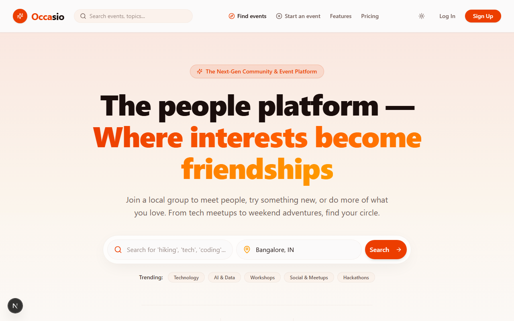

### Public discovery

| Events listing | Event detail |
| --- | --- |
| 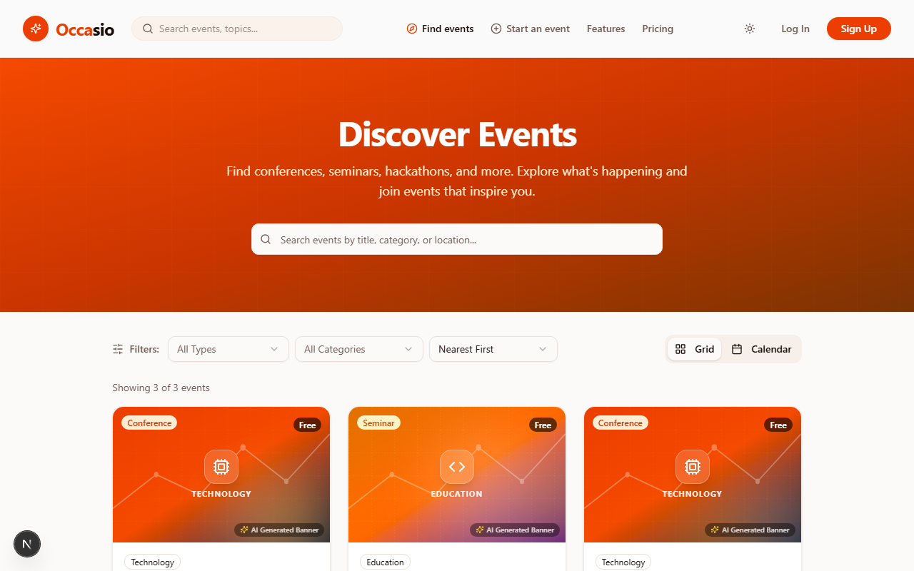 | 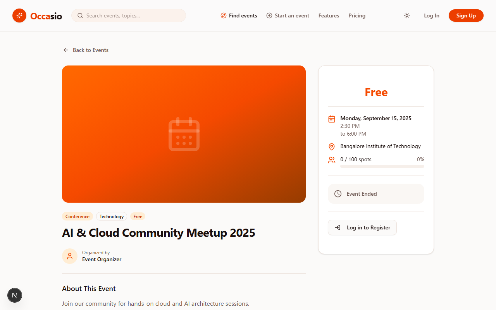 |

### Authentication

| Sign in | Create account |
| --- | --- |
| 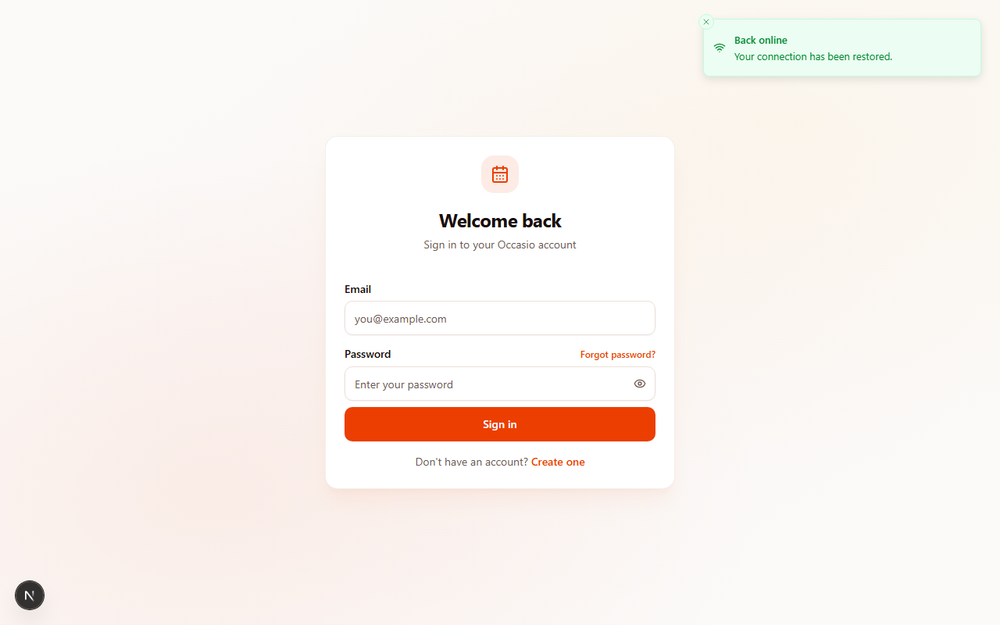 | 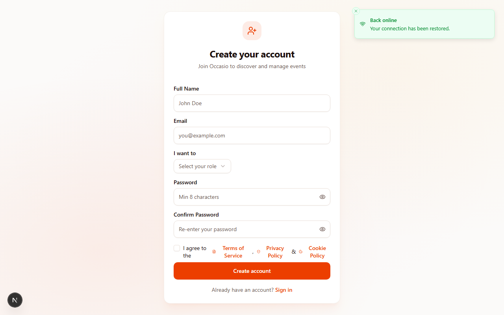 |

### Organiser dashboard

| Overview | My events |
| --- | --- |
| 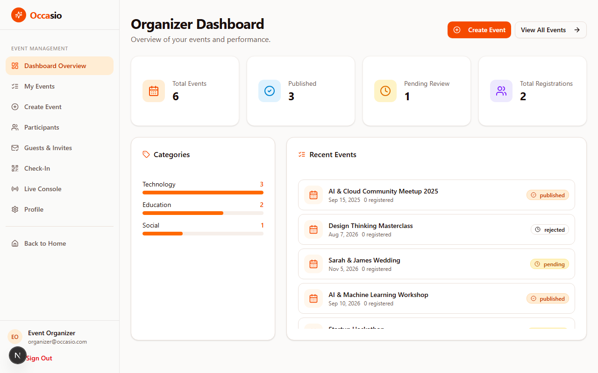 | 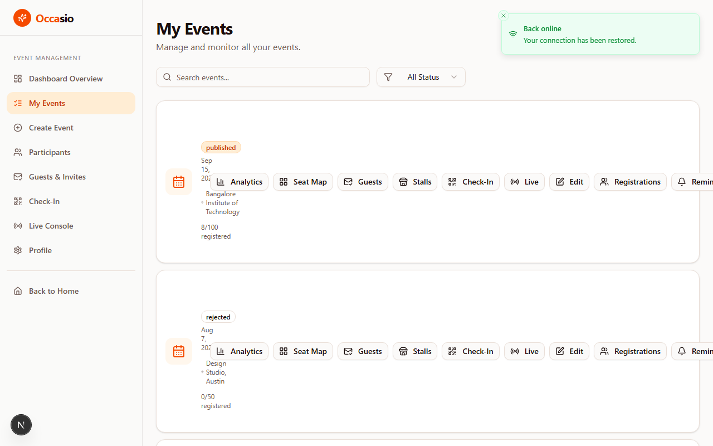 |

| Event analytics | Seat map builder |
| --- | --- |
| 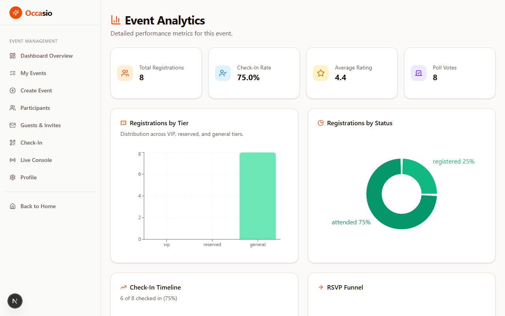 | 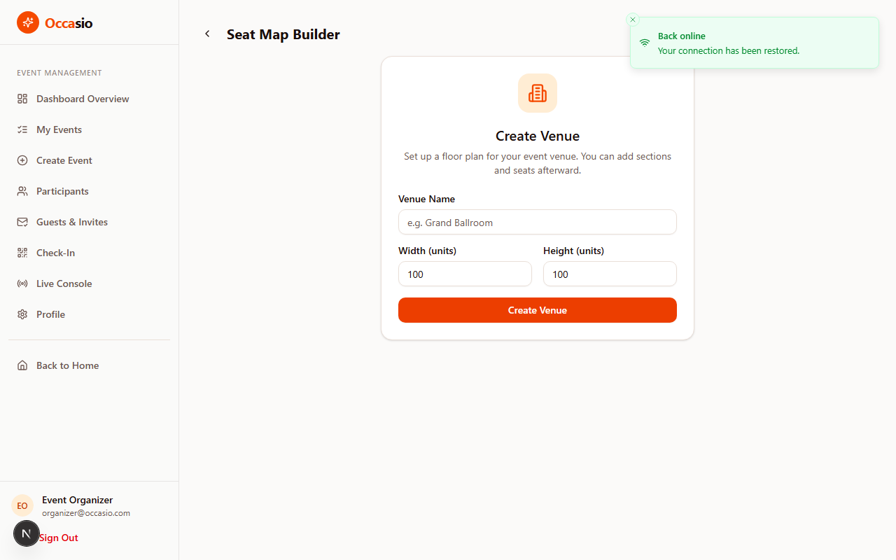 |

| Live console | Guests & invites |
| --- | --- |
| 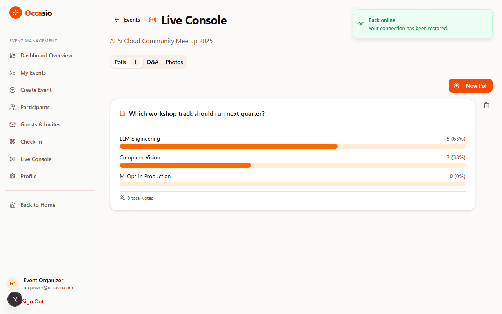 | 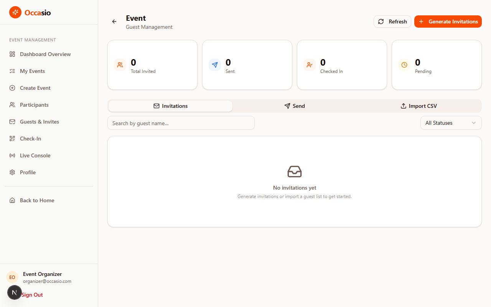 |

### Administration

| Pending events |
| --- |
| 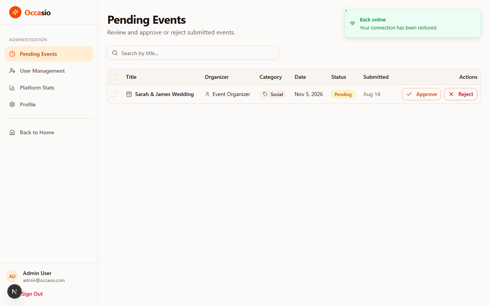 |

---

## What it's for

Teams that run meetups, conferences, workshops, weddings and private ceremonies need more than a listing page. They need to design the room, admit the right people, keep the room engaged while the event runs, and make sure the catering and suppliers actually turn up.

Occasio is built around that loop:

1. **Publish and attract** — a public site with search, category and date filters, grid/calendar views, shareable event pages, reviews and registration.
2. **Plan and configure** — per-event analytics, guest lists with CSV bulk import and email invitations, a 2D/3D venue and seat-map builder, food stalls with automatic backup-vendor discovery.
3. **Run the event** — QR ticket check-in with duplicate-entry protection, a live console for polls, Q&A and a moderated photo wall, and real-time updates pushed over WebSockets.
4. **Oversee the platform** — admin review of pending events, user and role management, bulk actions and platform analytics.

Roles are built in: **customer**, **organizer** and **admin**, each with a different navigation and API surface.

---

## Feature highlights

### Public discovery
- Marketing landing page with search, trending categories and featured events
- Events listing with full-text search, type/category/date filters, sort options, and grid or calendar view
- Event detail page with poster, schedule, venue map preview, capacity, reviews, related sections and live countdowns
- Registration with tier support, waitlisting and cancellation/refund tracking
- Digital ticket page rendered from a signed invitation token

### Organiser workspace
- Event CRUD with poster, capacity, pricing, free/paid flag and publish state
- Per-event analytics: total registrations, registrations by tier and status, RSVP funnel, seat utilisation, poll results, check-in stats
- Guests & invites: invitation generation, bulk CSV import, bulk email dispatch, resend and revoke
- Venue builder: sections, tiers, seats, POIs, plus a real-time 3D seat map rendered with Three.js and drag-and-drop editing in 2D
- Automatic seat assignment and bulk seat sync
- Check-in: camera QR scanning, manual check-in, search, and live attendance stats
- Food stalls and backup vendors, with distance tracking plus contact/promote flows when a supplier declines
- Live console: create and moderate polls, answer and approve Q&A, and moderate photo uploads
- Co-organizers, event reminders, and lobby signage with directional POIs

### Attendee experience
- Upcoming and past tickets, saved/bookmarked events, and a personalised dashboard
- Lobby page with venue map and directions to points of interest

### Administration
- Pending event approval and rejection, with bulk actions
- User management: role changes, block/unblock, leaderboard
- Platform analytics and incident moderation

### Real-time layer
A standalone Socket.IO service broadcasts events including `event:broadcast`, `registration:count`, `seat:update`, `seat:bulk-sync`, `checkin:scan`, `poll:new`, `poll:vote`, `qna:new-question`, `photo:new-upload`, `stall:update`, `notification:push`, and staff-channel variants.

---

## Tech stack

| Layer | Technology |
| --- | --- |
| Framework | Next.js 16 (App Router, Turbopack), React 19 |
| Language | TypeScript 5 |
| Runtime | Bun (dev + production `start`), Node 20+ supported |
| Styling | Tailwind CSS v4, shadcn/ui on Radix primitives |
| Data | Prisma 6 + SQLite |
| Auth | NextAuth v4 — credentials provider, JWT sessions, role-aware |
| Server state | TanStack Query |
| Client state | Zustand |
| Animation | Framer Motion |
| 3D | Three.js, `@react-three/fiber`, `@react-three/drei` |
| Charts | Recharts |
| Calendar | react-big-calendar |
| Drag & drop | dnd-kit |
| QR / barcodes | `bwip-js` (Code128 barcodes), `html5-qrcode` (camera scanning) |
| Email | Nodemailer (SMTP) |
| Validation | Zod |
| Toasts | shadcn/Radix toast + Sonner |
| Real-time | Socket.IO 4 (separate service) |
| Reverse proxy | Caddy (optional, for the real-time path) |

---

## Architecture

```
.
├── frontend/                  # Next.js app: UI + API route handlers + realtime client
│   ├── src/app/               # App Router
│   │   ├── (public)/          # marketing + attendee-facing pages
│   │   ├── (auth)/            # login / signup / forgot-password
│   │   ├── (dashboard)/       # role-aware dashboards (customer, organizer, admin)
│   │   ├── api/               # REST-style route handlers (~90 endpoints)
│   │   └── layout.tsx         # providers: theme, session, query, socket
│   ├── src/components/        # UI + feature components (events, live, seatmap, stalls…)
│   ├── src/lib/               # prisma client, auth, email, helpers
│   └── prisma schema output → frontend/node_modules/.prisma/client
├── backend/socket-service/    # standalone Socket.IO server (Bun), port 3003
├── database/
│   ├── prisma/schema.prisma   # data model (git-ignored, see below)
│   └── db/custom.db           # SQLite database
└── Caddyfile                  # reverse proxy that also carries the socket port
```

**Request flow.** The browser talks only to Next.js. Page components are either Server Components that read the database directly or Client Components that call the `/api/*` route handlers. Nothing else needs to be exposed.

**Real-time flow.** A separate Bun process runs the Socket.IO server. The browser connects through Caddy using the `?XTransformPort=3003` query convention (see [Known limitations](#known-limitations)).

---

## Getting started

### Prerequisites

- [Bun](https://bun.sh) 1.3+ (recommended; Node 20+ also works)
- Nothing else — SQLite ships with Prisma, no external database required

### 1. Install the app dependencies

```bash
cd frontend
bun install        # or: npm install
```

### 2. Configure the environment

Create `frontend/.env.local`:

```bash
DATABASE_URL="file:../db/custom.db"     # resolved relative to database/prisma/
NEXTAUTH_URL="http://localhost:3000"
NEXTAUTH_SECRET="generate-with: openssl rand -base64 32"
```

> **Path note:** Prisma resolves a relative SQLite `DATABASE_URL` against the **schema** directory (`database/prisma/`), not the app root. From there, `../db/custom.db` resolves to `database/db/custom.db`.

SMTP variables are only needed if you want invitation and reminder emails (see [Environment variables](#environment-variables)).

### 3. Create the database

```bash
cd frontend
bun run db:generate   # prisma generate
bun run db:push       # prisma db push (create/refresh the SQLite schema)
bun run db:migrate    # or use migrations instead of db push
```

> **Fresh clone caveat:** the root `.gitignore` excludes `database/`, so `schema.prisma` is not in the repository. Restore it (or un-ignore that path) before running the commands above.

### 4. Seed demo data (optional)

Run it from the repository root, where Bun auto-loads the root `.env`:

```bash
cd ..
bun database/prisma/seed.ts
```

Make sure `DATABASE_URL` is available to that process (root `.env`, or the variable exported in your shell). The script clears existing data and recreates three users, events, venues, seats, stalls, registrations and reviews. **It is destructive** — it calls `deleteMany()` on every model first.

### 5. Run the app

```bash
cd frontend
bun run dev        # http://localhost:3000
```

### 6. Run the real-time service (optional)

```bash
cd backend/socket-service
bun install
bun run dev        # Socket.IO on port 3003
```

### 7. Optional: run the proxy

```bash
caddy run          # serves http://localhost:81
```

Needed for live updates in the browser, as described in [Known limitations](#known-limitations).

---

## Demo accounts

Seeded by `database/prisma/seed.ts`. All three share the same password.

| Email | Password | Role |
| --- | --- | --- |
| `admin@occasio.com` | `password123` | admin |
| `organizer@occasio.com` | `password123` | organizer |
| `customer@occasio.com` | `password123` | customer |

These are development-only credentials. Change them before any deployment.

---

## Environment variables

| Variable | Used by | Purpose |
| --- | --- | --- |
| `DATABASE_URL` | Prisma | SQLite connection string, relative to `database/prisma/` |
| `NEXTAUTH_URL` | NextAuth | Canonical app URL used for callbacks |
| `NEXTAUTH_SECRET` | NextAuth | Signs/encrypts the JWT session |
| `SMTP_HOST` `SMTP_PORT` | Nodemailer | Outgoing mail server |
| `SMTP_USER` `SMTP_PASS` | Nodemailer | Mail credentials |
| `SMTP_FROM` | Nodemailer | Sender address for invitations/reminders |
| `NODE_ENV` | Next.js | Runtime mode |

The Socket.IO port is currently hardcoded to `3003` in `backend/socket-service/index.ts` rather than read from the environment.

---

## Scripts

**frontend/**

| Script | What it does |
| --- | --- |
| `bun run dev` | Next.js dev server with Turbopack (`next dev -p 3000`) |
| `bun run build` | Production build, including copying static assets into the standalone output |
| `bun run start` | Serves `.next/standalone/server.js` with Bun |
| `bun run lint` | ESLint over the app |
| `bun run db:generate` | Regenerate the Prisma client |
| `bun run db:push` | Push the schema straight to the database |
| `bun run db:migrate` | Create/apply a migration |
| `bun run db:reset` | Reset the database |

**backend/socket-service/**

| Script | What it does |
| --- | --- |
| `bun run dev` | Socket.IO server with hot reload (`bun --hot index.ts`) |

---

## Data model

21 Prisma models over SQLite:

- **Auth** — `User`, `Account`, `Session`, `VerificationToken`
- **Events** — `Event`, `Registration`, `Review`, `Bookmark`, `CoOrganizer`, `Notification`
- **Venue** — `Venue`, `VenueSection`, `Seat`, `POI`
- **Ticketing** — `Invitation`
- **Vendors** — `FoodStall`, `BackupVendor`
- **Live** — `Poll`, `PollResponse`, `QnAQuestion`, `Photo`

JSON-ish columns (`tags`, `coordinates`, `interests`, `options`, `upvotedBy`) are stored as strings and parsed at the API boundary — see `parseJsonField` / `toJsonField` in `frontend/src/lib/api-utils.ts`.

---

## API surface

Roughly 84 route handlers live under `frontend/src/app/api`. They follow NextAuth session checks plus role guards, and return a consistent envelope: `{ success: true, data }` or `{ success: false, error }`.

| Area | Examples |
| --- | --- |
| Events | `GET/POST /api/events`, `GET/PUT/DELETE /api/events/[id]`, `/api/events/categories`, `/api/events/recommended` |
| Registration | `/api/events/[id]/register`, `/api/events/[id]/registrations`, `/api/events/[id]/cancel-registration` |
| Analytics | `/api/events/[id]/analytics` plus `checkin`, `polls`, `rsvp-funnel`, `seat-utilization` |
| Ticketing | `/api/events/[id]/invitations`, `/invitations/generate`, `/invitations/send`, `/api/invitations/[id]/{resend,revoke}`, `/api/ticket/[invitationId]` |
| Check-in | `/api/checkin/scan`, `/api/checkin/manual`, `/api/checkin/search`, `/api/checkin/[eventId]/stats` |
| Venue | `/api/venues/seats`, `/api/venues/sections`, `/api/venues/pois`, seat assign/unassign, seat generation |
| Live | `/api/events/[id]/polls`, `/api/polls/[id]`, `/api/polls/[id]/vote`, `/api/events/[id]/qna`, `/api/qna/[id]/*`, `/api/events/[id]/photos`, `/api/photos/[id]/moderate` |
| Vendors | `/api/events/[id]/stalls`, `/api/events/[id]/stalls/[stallId]/backup-vendors`, `/api/backup-vendors/[vendorId]/*` |
| Lobby | `/api/events/[id]/lobby`, `/lobby/poi`, `/lobby/direction` |
| Admin | `/api/admin/pending-events`, `/api/admin/events/[id]/{approve,reject}`, `/api/admin/users/[id]/{role,block,unblock}`, `/api/admin/analytics`, `/api/admin/stats` |
| User | `/api/users/me`, `/api/users/me/bookmark`, `/api/users/me/notifications`, `/api/auth/profile` |

---

## Deployment

```bash
cd frontend
bun run build
bun run start          # NODE_ENV=production, serves .next/standalone
```

The build emits a standalone server under `frontend/.next/standalone`, so you can deploy the app as a single Node/Bun process with no external services beyond the SQLite file.

For real-time features in production, run the socket service alongside the app and put Caddy (or any proxy that understands the `XTransformPort` convention) in front of both.

---

## Known limitations

Honest list of gaps in the current state of the codebase:

- **Real-time needs the Caddy proxy.** The client connects with `io('/?XTransformPort=3003')`, which only resolves when Caddy is running on port 81. Without it the socket connection fails and live updates silently stop, though all REST-backed pages still work.
- **The Prisma schema is git-ignored.** `database/` is excluded by the root `.gitignore`, so a fresh clone has no `schema.prisma` and cannot run `db:generate` until it is restored or un-ignored.
- **Only `README.md` is tracked as documentation.** The root `.gitignore` ignores `*.md` apart from `README.md`, so the PRD and architecture notes live outside version control.
- **The customer dashboard currently crashes.** `/customer` throws `TypeError: bookmarkedEvents.map is not a function`: the page reads `data.events || data` from `/api/users/me/bookmark`, which actually returns a `{ success, data }` envelope, so the query resolves to the envelope object instead of an array. It is why there is no screenshot of that page above.
- **Customer dashboard anchors are incomplete.** The sidebar links to `#past`, `#saved` and `#browse`, but those ids do not exist on the customer page yet, so those three links do nothing.
- **Two toast libraries are in use.** Sonner and the shadcn/Radix toast are both called from different files; both renderers are mounted so neither is silently dropped, but the duplication is worth consolidating.
- **No automated test suite.** There is currently no test runner configured.
- **Pre-existing TypeScript errors.** `tsc --noEmit` reports errors in a handful of files (mostly chart typings and a few API handlers). They predate the recent fixes and are unrelated to them.

---

## Contributing

1. Branch from `main`.
2. Keep changes focused — one logical fix or feature per commit, with a message that explains *why*.
3. Run `bun run lint` and `bun run db:generate` before pushing.
4. Never commit `.env`, the SQLite database, or `node_modules`.

---

## License

No license file has been chosen yet. Add one before distributing the code.